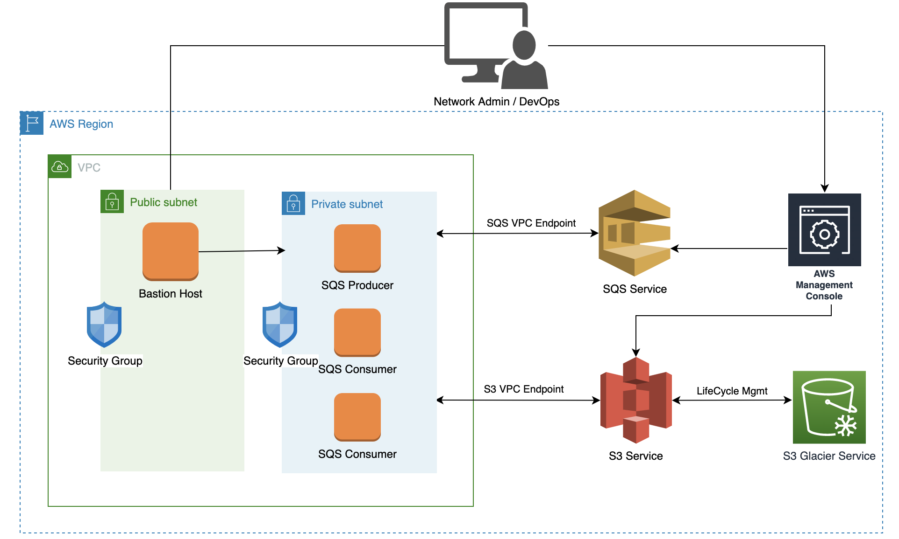
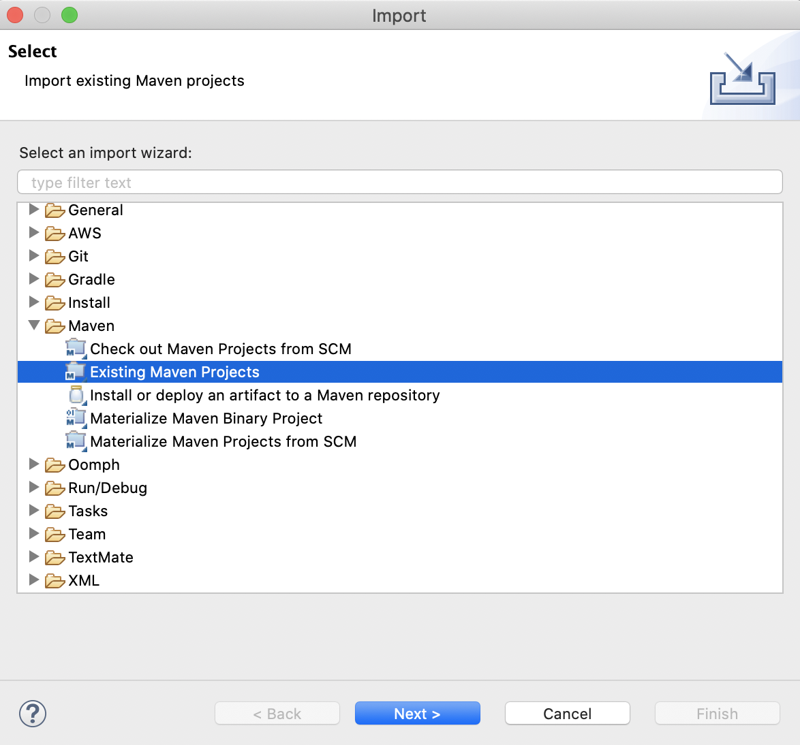
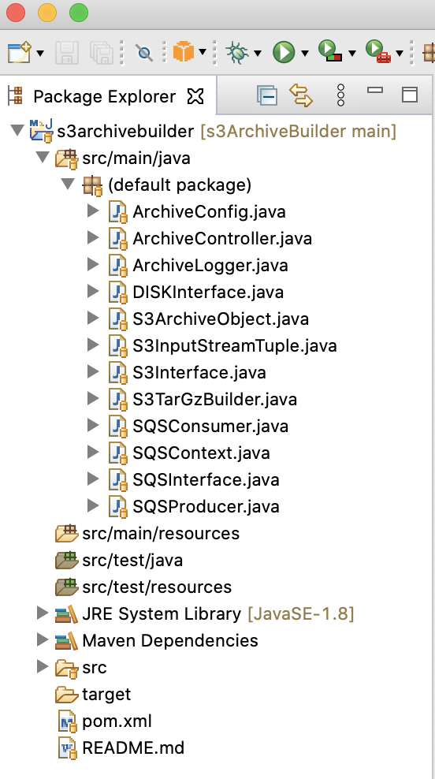
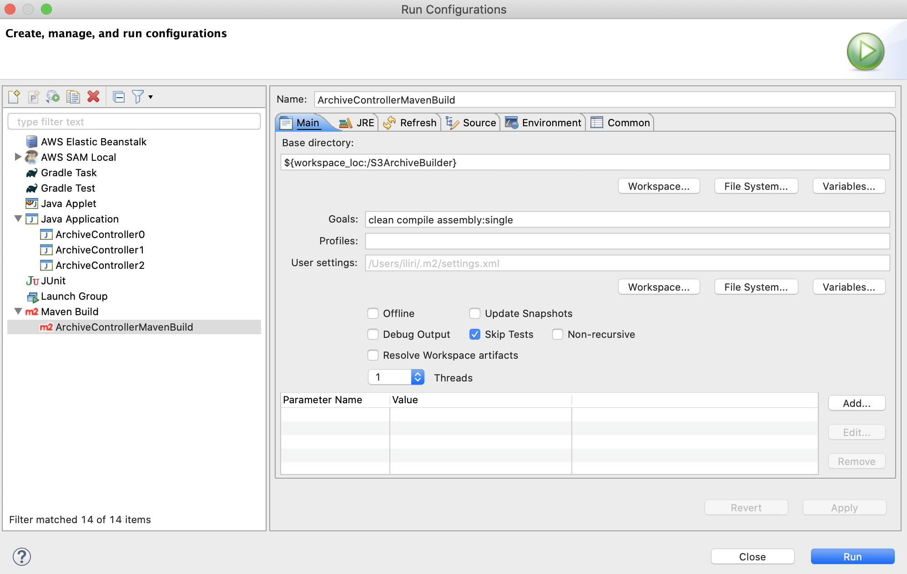
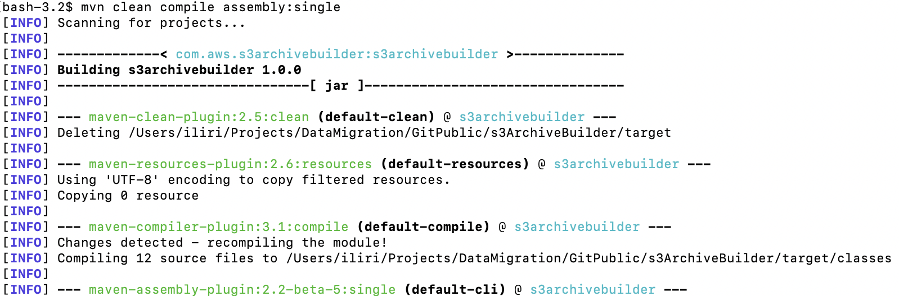
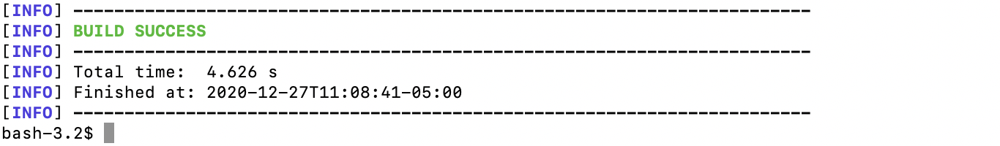
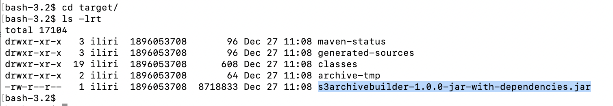

# s3ArchiveBuilder
The purpose of this project is to build archive objects suitable for Amazon S3 Glacier. S3 customers who have not designed for data archiving in their cloud storage architectures and who are looking to reduce operational costs associated with non-archival storage classes may find it costly to archive into Glacier via lifecycle policies or S3 Intelligent Tiering. This is particularly the case if the workloads do not align with Cold Storage best practices. Best practices include but are not limited to; reducing the number of objects that will ultimately be archived and organizing objects into archives by an indexing scheme or lookup strategy thereby reducing or eleminating overhead associated with restoring archived objects of interest. 

This project was motivated by a real customer use case consisting of ~ 450 million objects that needed to be archived into Glacier. The objects were relatively small in size and produced by a distibuted application that was commiting objects daily to S3 Standard. When the customer realized the costs associated with archiving this large number of objects they sought out a solution. The AWS Solutions Architecture Team and the customer did extensive reseach to come up with this solution and are sharing it freely with others who are running into a similar problem. 

This source code provides customers interested in this approach with a highly performing and cost effective architecture that can be modified or evolved to meet their business needs. This project should be thought of as a starting point or a framework and should be thoroughly tested in order to ensure that it satisfies the specific use cases or requiments set forth by it's designers. The source code for this project is not supported by AWS and no new features will be added to the project.  

# Project Description
s3ArchiveBuilder is a Maven Java Project leveraging the AWS Java SDK (2.0+). It is compatible with Java 8+ JRE, Maven version 3.6+ and developed on the open Eclipse IDE. Upon modifying and building the source code into an executable jar file it can be executed on an EC2 instance that satisfies the environment runtime requirements or contaniarized to run on AWS EKS (Elastic Kubernetes Service) or AWS ECS (Elastic Container Service). This solution is a distributed producer/consumer architecture leveraging AWS SQS (Simple Queue Service).

# Macro-Architecture Overview


In order to be as cost effective as possible this project should be executed on AWS Compute (EC2/EKS/ECS). It is important to note, however, that with the use of IAM Keys it is possible to run this solution on-premises as well. However, the bandwidth costs associated with reading objects out of Amazon S3 should be  considered in the case where the solution is executed outside of AWS Compute. In addition, in the interest of security it is recommened that the solution is executed in a private subnet that can be accessed only via a controlled bastion host as shown in the diagram. Of particular interest are the service endpoints used to communicate with the AWS resources such as S3 and SQS directly via AWS PrivateLink by way of Interface/Gateway Endpoints that can be configured directly from the VPC panel on the AWS Console. See the procedures below for more information on how to do this.

[Procedure to configure S3 Gateway Endpoint](https://aws.amazon.com/blogs/aws/new-vpc-endpoint-for-amazon-s3/)

[Procedure to configure SQS Interface Endpoint](https://aws.amazon.com/about-aws/whats-new/2018/12/amazon-sqs-vpc-endpoints-aws-privatelink/)

Upon configuring the Interface Endpoints from your VPC, use the AWS CLI from an EC2 instance in your private subnet to ensure that the services can be reached via AWS Private Link:

```
#aws s3 ls
#aws sqs list-queues
```

## Architectural Components
This project has three major architectural components: controller, producer and consumer. The controller is responsible for reading the configuration and initializing/starting the right processing component either the producer or consumers. The SQS Producer lists objects from a source S3 bucket and constructs archive contexts (work items). A work context contains information about all the keys that should be included into a particular archive file such as tar. Work contexts produced by SQS Producer are uploaded to an AWS SQS Standard Queue where they could be processed by consumers (workers). SQS Consumers retrieve and process work contexts from the queue. Upon retrieving a work context the SQS Consumers will read all the objects listed in the context from Amazon S3 (asynchronously) and write these objects (InputStreams) into a compressed archived file (tar.gz). Once the compressed archive file is created it is once again uploaded to Amazon S3 where a cost effective Lifecycle Policy can help transition the archive object into Glacier. Upon successful archival, the SQS Consumer can optionally delete the object keys included from the source bucket. SQS Consumers will exit as soon as the SQS Queue size is 0. It is recommended that the SQS producer is started prior to the consumers or that the architecture is modified such that the producer can throttle its rate of ingress into the SQS Queue depending on the rate in which the work contexts are being processed.    

The SQS Producer is intented to be single threaded and requires minimal resources to run. It can be effectively executed on free tier compute (e.g. m2.micro) as it is not the performance bottleneck of the system. Work contexts will generally be generated a lot faster than they can be consumed/processed unless the SQS Consumer fleet consists of many EC2 instances each running multiple SQS consumer threads. It is highly recommended that the bulk of intelligence around generating the work contexts is programmed into the Producer. That is, in order to optimize the efficiency of architecture the consumers shouldn't do any special processing that can lead to upredictability of the performance model other than the basic work flow defined; read objects, add objects to archive, upload archive and delete objects.

The SQS Consumers are intended to be run as a multi-threaded, distributed application or cluster that can digest work items from the shared SQS Queue. At present, the SQS Consumers will only run one Consumer thread per vCPU in order to optimize performance and reduce cpu context switching. However, this can easily be modified in the SQS Consumer source code. Each SQS Consumer thread carries out the same function within the s3ArchiveBuilder distributed application. 
  

# Maven Project Import Instructions
Use git to clone the project locally and then import it as a Maven Project into your Java IDE. (Eclipse or the IntelliJ). The following instructions show how to do this in Eclipse but there are tutorials available  that show how to do this on IntelliJ. [Import Maven Project into IntelliJ](https://www.lagomframework.com/documentation/1.6.x/java/IntellijMaven.html)

  1. Open Eclipse and create a new workspace (e.g. s3ArchiveBuilder)
  
  2. File -> Import -> Maven -> Existing Maven Project -> Next
  
  
  3. Select the root directory containing pom.xml -> Next
  
  4. Project appears in Project Explorer
  
  
  5. Modify source code as necessary
  
  
# Building Instructions  
To build the project directly on Eclipse you may configure a Maven Run Configuration. Equivalently the project may also be built on a terminal window (shell).

  1. Right Click on Project (Project Explorer) -> Run As -> Run Configurations -> Maven Build
  
  2. Create a New Maven Build Configuration (Substitute path to your own BaseDirectory, Ensure you have selected the right JRE 1.8+)
  
  
  3. Alternatively Build the Project on Terminal Shell
  
  ...
  
  
  4. In both cases the resulting executable can be found in the target folder
  

# Running Instructions 
Before running this application it is important to ensure that the compute runtime environment supports it. Since the application is written in Java it can run on any Platform so long as the Java JRE is installed. As previously noted this project is compatible with Java 8 but should compile and work on higher java versions (8+). With that said, it is recommened that some testing is done to ensure that everything will work as expected. To install Java 8 openjdk on Amazon Linux 2 issue the following command:

```
# sudo yum install java-1.8.0-openjdk
```

Take note that this command will require access to the internet to work as it has to pull from RHEL yum repositories. Issuing this command from an EC2 instance in a private subnet will not work as there will be no route to the public internet. This will require a NAT Gateway to get out to an internet gateway that can route requests to the public internet. Thus, if this solution is to be executed in a private subnet it is recommened that an AMI containing Java 8 be built in a public subnet first. 

To run the project on AWS Linux 2 issue the following command in a screen session:
```
#screen -S producer
#java -DconfigurationFile='/home/ec2-user/BaseDir0/Configuration/ControllerConfiguration0.json' -jar s3archivebuilder-1.0.0-jar-with-dependencies.jar
#

CTRL+A+D (detach from screen session)
screen -r producer (attach to existing screen session)
```

## Configuration File
The application takes a json configuration file as input at runtime via a Java System Property. The following configuration options are currently supported. 

```
{
    "type":"producer",
    "baseDirectory":"/home/ec2-user/BaseDir0/",
    "awsCredentials":"/home/ec2-user/.aws/credentials",
    "sourceBucket":"migration-archive-objects",
    "targetBucket":"migration-archive-objects",
    "archiveFilePrefix":"Archive",
    "archiveFileFolder":"Archive/",
    "region":"us-east-2",
    "queue":"https://sqs.us-east-2.amazonaws.com/815930979491/S3ArchiveBuilder",
    "groupID":"12345",
    "filter":"5m-device-metrics",
    "command":"run",
    "s3ThreadNum":"1"
}
```

